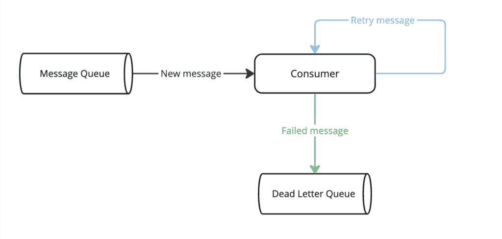

# products-consumer-section-11

This repository contains consumer application which consumes events from Kafka topic. So that, 
this module depends on Kafka topic called "products-created-topic".

The main goal in this project is to learn how to configure next characteristics:
1. Dead Letter Topic (DLT). Go to KafkaConfig class to get more details.


## How to Run the Application
**Note: [You have to start Kafka containers before starting application.](#How-to-Start-Kafka-Containers)**

To start the application from command line you can use next commands:

Using Java jar command:

    ** java -jar target/products-consumer-section-11-1.0.0.jar

Where X means number module that you can run. For example:

    ** java -jar target/products-consumer-section-11-1.0.0.jar

Using Maven:

    ** mvn spring-boot:run

However, it is necessary to add next plugin to your pom.xml file:

```
...
<build>
    <plugins>
    ...
        <plugin>
		    <groupId>org.springframework.boot</groupId>
			<artifactId>spring-boot-maven-plugin</artifactId>
			<configuration>
				<excludes>
					<exclude>
						<groupId>org.projectlombok</groupId>
						<artifactId>lombok</artifactId>
					</exclude>
				</excludes>
			</configuration>
		</plugin>
    ..
    </plugins>
</build>
...
```

## How to Start Kafka Containers
Before to start the application, we need to start Kafka containers. So, you can start Kafka containers in two ways 
from command line:

1. Through Docker Compose
2. Through Docker CLI

### Docker Compose
To start Kafka containers you can run next command:

    docker-compose up -d -f $PATH_LOCATION/docker-compose_3.yml --env-file environment.env

Where $PATH_LOCATION is path to docker-compose.yml file.

### Docker CLI
Use next commands to start Kafka containers:

    docker start container_id

To get container id you have to run next command:

    docker ps -a

### Starting Kafka Containers
After starting Kafka containers you can connect to Kafka brokers from command line:

    docker exec -it <container ID or name> bash

1. Docker Compose Names

        docker exec -it docker-compose-kafka-1-1 bash
        docker exec -it docker-compose-kafka-2-1 bash
        docker exec -it docker-compose-kafka-3-1 bash

    **Note: Docker Compose Names are defined in "docker-compose_3.yml" file through "container_name" attribute.
        It is important to note that docker compose add the prefix "docker-compose" to container name. 
        At the end, the final name it will be "docker-compose-container_name".**

2. Docker Container ID 

        docker exec -it 9c5bc1dfd9bb bash
        docker exec -it a804bd0560ce bash 
        docker exec -it 78efb35e6e95 bash

To get container id you can run next command:

    docker ps -a

### Kafka Console Consumer
Once you connect and started Kafka brokers, go to next path:

    cd /opt/bitnami/kafka/bin/

To consume the events from Kafka topic run the following command:

    ./kafka-console-consumer.sh --topic products-created-topic --bootstrap-server host.docker.internal:9092 --from-beginning -property print.key=true
    ./kafka-console-consumer.sh --topic products-created-topic --bootstrap-server host.docker.internal:9094 --from-beginning -property print.key=true
    ./kafka-console-consumer.sh --topic products-created-topic --bootstrap-server host.docker.internal:9096 --from-beginning -property print.key=true

### Kafka Console Producer
Once you connect and started Kafka brokers, go to next path:

    cd /opt/bitnami/kafka/bin/

To produce the events to Kafka topic run the following command:

    ./kafka-console-producer.sh --topic products-created-topic --bootstrap-server host.docker.internal:9092 --property parse.key=true --property "key.separator=:"
    ./kafka-console-producer.sh --topic products-created-topic --bootstrap-server host.docker.internal:9094 --property parse.key=true --property "key.separator=:"
    ./kafka-console-producer.sh --topic products-created-topic --bootstrap-server host.docker.internal:9096 --property parse.key=true --property "key.separator=:"

## How to Configure Kafka Consumer
Kafka Consumer can be configured by two ways:

1. Adding properties to application.properties file.
2. Or programmatically way creating Kafka config class annotated with Spring Boot annotation
   **org.springframework.context.annotation.Configuration**.

   Go to **com.acme.common.config.kafka.KafkaConfig** to get more details.

   **Note: This way override any configuration defined in application.properties file.**

If you choose to configure Kafka Consumer programmatically you will basically have to define next:

1. Define a Java Map with Consumer configs.
2. Create a ConsumerFactory with the consumer config map.
3. Create a ConcurrentKafkaListenerContainerFactory with the consumer factory. It is important to use default name 
"kafkaListenerContainerFactory", if not Spring Boot's autoconfiguration factory will use default (String) deserializer, 
and it will be caused next exception:
  
**org.springframework.messaging.converter.MessageConversionException: Cannot convert from [java.lang.String] to [] for GenericMessage** 

### Bootstrap Servers List
Bootstrap servers list corresponds to Kafka brokers (list of the servers that compose your Kafka cluster). To configure 
bootstrap servers list you will have to add next property into application.properties file: 

    spring.kafka.consumer.bootstrap-servers=localhost:9092,localhost:9094,localhost:9096

### Key and Value Deserializers
Key and value deserializers work together to convert the serialized key and value from a Kafka message back into their
original types. Deserializers (key and value) will be used by Kafka Consumer to deserialize key and value's 
message/event received. To configure key and value deserializers you can use next properties into 
application.properties file: 

      spring.kafka.consumer.key-deserializer=org.apache.kafka.common.serialization.StringDeserializer
      spring.kafka.consumer.value-deserializer=org.springframework.kafka.support.serializer.JsonDeserializer

### Trusted Packages
When messages in the topic have different payload schema it will be a great idea to restrict the possible payload 
schemas consumer will accept. This is what the Spring Kafka trusted packages feature is about. 

Trusted packages Spring Kafka feature is configured on the deserializer level. If trusted packages are configured, 
then Spring will make a lookup into the type headers of the incoming message. Then, it will check that all of 
the provided types in the message are trusted – both key and value.

It essentially means that Java classes of key and value, specified in the corresponding headers, must reside inside 
trusted packages. If everything is ok, then Spring passes the message into further deserialization. If the headers 
are not present, then Spring will just deserialize the object and won’t check the trusted packages.

To configure the trusted packages you will have to add next property into application.properties file:

      spring.kafka.consumer.properties.spring.json.trusted.packages=*

### Group ID
GroupId is central to the load-balancing mechanism, enabling the distribution of partitions among consumers. 
Consumer Groups manage the coordination, load balancing, and partition assignment among consumers within the same group.

Consumer Groups consist of multiple consumers who work together to consume messages from one or more topics. 
They enable scalability, fault tolerance, and efficient parallel processing of messages in a distributed Kafka environment.

Crucially, each consumer within the group is responsible for processing only a subset of its topic, known as a partition.

To configure the group id you will have to add next property into application.properties file:

      spring.kafka.consumer.group-id=product-created-events

### Dead Letter Queue (DLQ) or Dead Letter Topic (DLT)
DLQ or DLT in Kafka is a special topic used to store messages that cannot be processed by a consumer due to errors.
Instead of  dropping these messages, the consumer can write them to the DLQ/DLT for later inspection and potential
reprocessing.



Using a DLQ is generally a good idea, but there are scenarios when it should be avoided. For instance, it's not recommended
to use a DLQ for a Queue where the exact order of messages is important, as reprocessing a DLQ message breaks the order
of the messages on arrival.

By default, Kafka creates a DLQ topic with the same name as the original topic, with "-dlt" appended to the name.
For example, if the original topic is called "my-topic", then the DLQ topic will be called "my-topic-dlt".

So, to test the DLT you will have produce an event with a bad payload. In this case, a payload that cannot be deserialized 
to JSON. For instance, you will have to produce a String event from CLI: 

      ./kafka-console-producer.sh --topic products-created-topic --bootstrap-server host.docker.internal:9094 --property parse.key=true --property "key.separator=:"

Produce a String event from CLI: 1: {Any_String}

And then, you will have to check the DLT topic. To consume the events from DLT run the following command:

      ./kafka-console-consumer.sh --topic products-created-topic-dlt --bootstrap-server host.docker.internal:9094 --from-beginning --property print.key=true --property print.value=true

And you will see the bad payload in the DLT topic.
